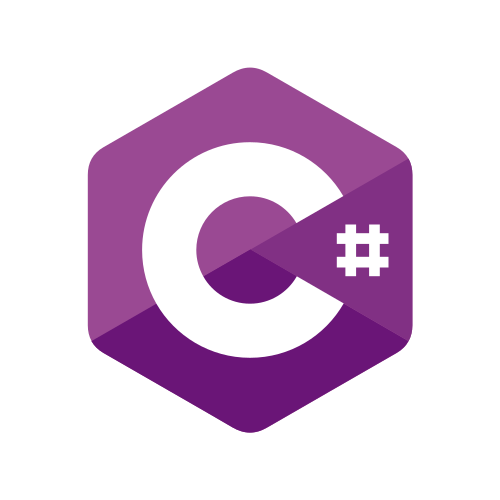

<!--magic:commad to preview markdown file cmd-k v -->

# Hi! I'm Aleksander 👋
 

### About me 💬 
 
I'm working as backend developer with technologies as .Net and PostgreSQL. Previously as worked as full-stack developer.

Also I have bachelor's degree in computer science.

---

Currently working on:

* Implementing RISC-V processor on FPGA. You can follow my progress on [blog](alexanderkus.github.io)
  
 

---

 

### Technologies and languages

---

 

My second [github profile](https://github.com/aleksanderkus00) mainly used for univeristy.
